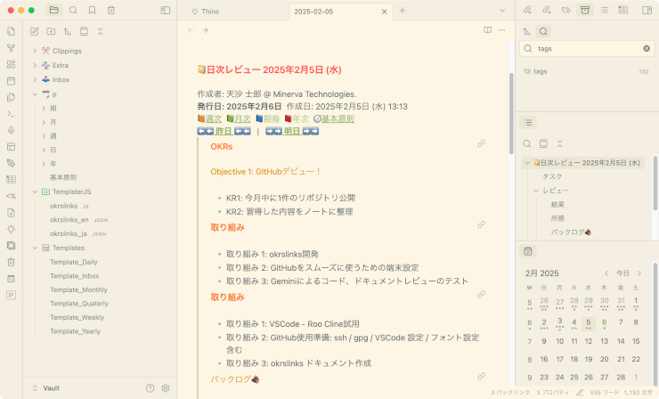
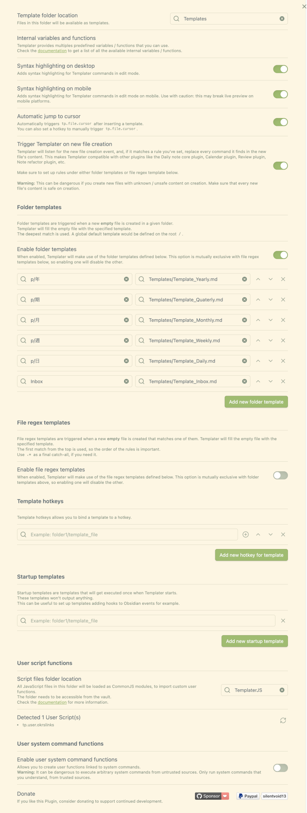

# obsidian-personal-okrs-templates

English | [Japanese](README_ja.md)

## Overview

**Templates** and **scripts** for implementing personal OKRs in the thinking tool Obsidian, designed to simplify template descriptions.

Have you ever considered using [OKRs - Objectives and Key Results](https://okr-framework.com/) in Obsidian, but found it challenging to embed links to related notes? Or perhaps, even with embedded links, the template becomes too code-heavy and difficult to maintain?

This project provides templates to get you started with OKRs immediately, along with scripts that simplify embedding links into your templates, making maintenance easier.

These templates are created based on [templates published on GitHub by Nicole](https://github.com/nicolevanderhoeven/obsidian-okrs).

## Target Users

  - Individuals who want to practice OKRs personally.
  - Those who want to avoid the hassle of creating templates and writing links.
  - Those who prefer to avoid code-heavy templates.

## Software

  - [Obsidian](https://obsidian.md/)
  - [Templater](https://github.com/SilentVoid13/Templater)
  - [Periodic Notes](https://github.com/liamcain/obsidian-periodic-notes)
  - (Optional) [Calendar](https://github.com/liamcain/obsidian-calendar-plugin)
  - (Optional) [Thino](https://github.com/Quorafind/Obsidian-Thino)
  - (Optional) [Admonition](https://github.com/javalent/admonitions)

## Features

### OKRs Templates

Templates utilizing the community plugins Periodic Notes and Templater.

- Template Files:
  - Core Principles: Your most cherished values and beliefs.
  - Yearly OKRs: Annual goals and key results.
  - Quarterly OKRs: Quarterly goals and key results.
  - Monthly OKRs: Monthly goals and key results.
  - Weekly Notes: Weekly action plans and achievements.
  - Daily Notes: Daily action plans and achievements.

- OKRs sections from higher-level periods are embedded in each period's template, ensuring constant visibility.

- Links to higher-level notes and notes from the same period (previous and next) enable easy creation and reference of related notes.

### okrslinks.js

User Script Function for the Obsidian Templater plugin.

- Features:
  - Provides variables that allow embedding strings used in templates with simple descriptions.
  - Variable formats can be customized via configuration files.
  - Configuration files automatically switch based on Obsidian's language settings.
  - Thino Support: String for memo insertion position.

## Setup

> [!WARNING]
>
> - There is a possibility of conflicts with existing Periodic Notes or Templater settings.
> - Please be careful with folder structure and settings.
> - It is strongly recommended to back up your existing Vault before proceeding.
> - Alternatively, consider using a separate Vault from your existing one.

### Settings to Consider Before Setup

Before setting up, consider and decide on the settings to be used for the plugins. The following explanation will follow this example:

  - Templater
      - Template folder location: e.g., `Templates`
      - User Script Function: e.g., `TemplaterJS`
  - Periodic Notes
      - Note folder location: e.g., `p/`
      - Note folder location for each period: e.g., `p/年, p/期, p/月, p/週, p/日`
        - (年: yearly, 期: quarterly, 月: monthly, 週: weekly, 日: daily)

### 1 Software Installation

- Install Obsidian.
- Disable restricted mode in Obsidian and install community plugins.
- After installing community plugins, enable them:
  - Periodic Notes / Templater
- Install and enable any other community plugins you plan to use:
  - Calendar, Thino, Admonition, etc.

### 2 Plugin Settings

- Templater
  - Set `Template folder location` (e.g., `Templates`).
  - Turn on `Automatic jump to cursor`.
  - Turn on `Trigger Templater on new file creation`.
  - Turn on `Enable folder templates`.
  - Set folder-template associations (e.g., `p/年` - `Templates/Template_Yearly.md`).
  - Set `User Script Function / Script files folder location` (e.g., `TemplaterJS`).

> [!NOTE]
> Templater's features - `Trigger Templater on new file creation`, `Folder templates`, and `User Script Function` are used.

Templater Setting Example

- Calendar (If using)
  - (Recommended) Turn off `Confirm before creating new note`
  - (Recommended) turn on `Show week number`.
- Daily Notes (If using)
  - Set `New file location` (e.g., `p/日`).
  - Set `Template file location` (e.g., `Templates/Template_Daily`).

> [!NOTE]
> If using the community plugin `Auto Filename`, ensure that daily to yearly notes are not targeted.

### 3 Download and File Placement

Download the files by clicking `Code` -\> `Download ZIP` in the top right of this GitHub page, extract the ZIP file, and place the files as follows:

- `TemplatesJS/*` -\> Folder set as `User Script Function`.
- `Template.*/*` -\> Folder set as `Template folder location`.
- `Documents/*` -\> Note storage location (e.g., storage folder for Periodic Notes `p/`, etc.).

### 4 Periodic Notes Settings

Configure for each period:

- Turn on `Each Period Notes` (Notes for each period).
- Set the corresponding template file for `Each Period Note Template` (Note Template for each period) (e.g., `Templates/Template_Daily`).
- Set the corresponding folder for `Each Period Note Folder` (Note Folder for each period) (e.g., `p/日`).

Periodic Notes Setting Example

### 5 Template and Configuration File Modifications

Refer to the [Customization](#Customization) section and configure the following items:

- Configuration File:
  - Note author, name of the Core Principles note.
- Templates:
  - Customize as you like.
    - E.g., Remove links to unnecessary periods.
  - If not using Thino, delete `<% o.thinoPlace %>` from Daily\_Template.md.
  - If you do not want to display the file after creation, such as when creating today's note with Thino, delete `<% tp.file.cursor() %>` from Daily\_Template.md.

## How to Use

### Initial Setup

1. Write `Core Principles`.
2. Create today's daily note (e.g., `Open Today`, click today on the calendar).
3. Create necessary higher-level OKRs notes (click the links to higher-level periods in the opened daily note).

OKRs operation preparation is now complete.

### Basic Flow

1. At the beginning of a period, consider OKRs - Objectives and Key Results.
   - Create a note for the corresponding period (yearly, quarterly, monthly, weekly, daily) at the beginning of the year, quarter, month, week, or morning, and write down OKRs.
2. Conduct a review at the end of the period.
   - At the end of the year, quarter, month, week, or evening, reflect and write a review in the note for the corresponding period.

## Customization

### Templates

The following variables can be used:

| Variable | Description |
| --- | --- |
| o.authorName | Note author |
| o.corePrinciplesNote | Document name of Core Principles |
| o.titleDate | Date used in the title |
| o.createdDate | Creation date |
| o.publishedDate | Publish date |
| o.prev | Link to the previous note |
| o.next | Link to the next note |
| o.weekly | Link to the weekly note |
| o.monthly | Link to the monthly note |
| o.quarterly | Link to the quarterly note |
| o.yearly | Link to the yearly note |
| o.thinoPlace | Thino memo creation heading |
| o.lang | Language |

- `o.weekly` to `o.yearly` are links to notes of the period that includes the target note.
- Periods are determined from the note title.

### Configuration Files

- Configuration files are in JSON format.
- The file is automatically selected based on Obsidian's language setting. If there is no corresponding configuration file, English will be used.

- Configuration Items:

| Item | Description |
| --- | --- |
| authorName | Note author |
| corePrinciplesNote | Note name of Core Principles |
| dateFormat | Date format for creation and publish dates |
| titleFormat | Date format used in the title |

### i18n (Internationalization)

- Create a file corresponding to the language set in your Obsidian.
  - Configuration file: okrslinks\_(lang).json
    - Example: okrslinks\_en.json, okrslinks\_ja.json, etc.

- (Reference) You can check the set language by writing the following in the template:
    - `<% o.lang %>`

## License

MIT License

## Development and Test Environment

- MacBook Air Retina, 13-inch, 2018 Intel
- MacOS Sonoma 14.7.3
- Obsidian v1.8.4
- Templater 2.9.1
- Periodic Notes 0.0.17
- Calendar 1.5.10
- Thino 2.4.59

## Contributions

- Welcome reports of operation in environments other than those listed above.
- Bug reports should be submitted as Issues.
- Information on other OKRs templates is also welcome.
- Provision of multi-language templates is also welcome.

## Other

This project was created for learning purposes. Opinions and questions are welcome.

## Acknowledgements

- I learned about OKRs from [Nicole's YouTube](https://youtu.be/T2Aeaq4sk7M).
  - It's okay to take it slow. Now is my time to do OKRs. Anyway, thank you.

- [OKR Framework | Learn how to use the OKR Framework for laser-focused growth](https://okr-framework.com/)
  - Thank you for the explanation of OKRs. I intend to read it carefully from now on.

- [Templater snippets](https://zachyoung.dev/posts/templater-snippets/#using-tpfileinclude-in-a-user-script)
  - Explanation about various software Templater. My understanding has deepened. Thank you.

- Obsidian / Calendar / Periodic Notes / Templater / Admonition / Thino ...
  - And of course, thanks to the creators of the wonderful apps and their authors. Thank you.

- Gemini
  - Thanks for your help with coding, docs, reviews, and translations!
