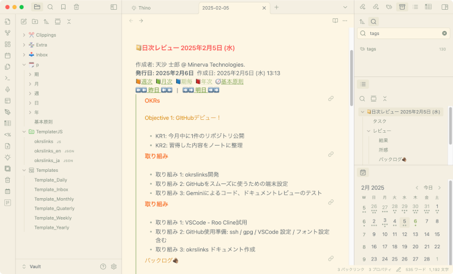
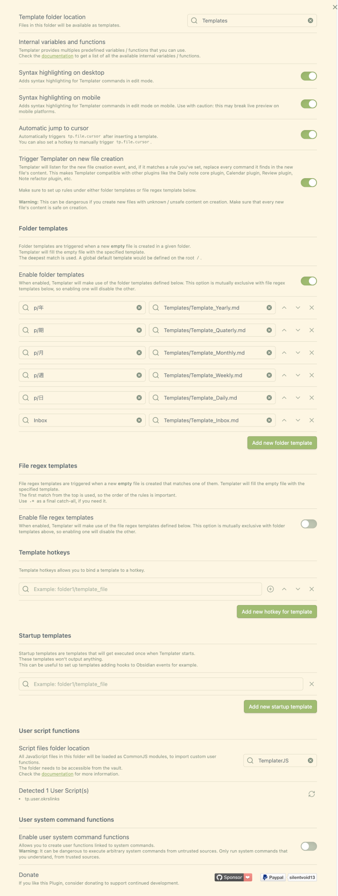
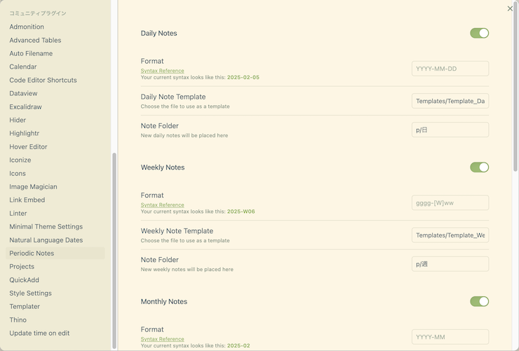

# obsidian-personal-okrs-templates

[英語](README.md) | 日本語

## 概要

思考ツール Obsidian で個人的な OKRs を実施する**テンプレート**と、テンプレートの記述をシンプルにする**スクリプト**

Obsidian で [OKRs - Objectives and Key Results (目標と主要成果)](https://okr-framework.com/) をやってみようと思ったけれど、関連するノートへのリンクを埋め込むのが大変だったりしませんか。またリンクを埋め込んだとしてもテンプレートがコードだらけでメンテナンスしづらくないですか？

これは OKRs にすぐに取り掛かれるテンプレートと、OKRs で使いたいリンクをテンプレートに簡単に埋め込みメンテナンスを容易にするスクリプトを提供します

テンプレートは[Nicole さんが GitHub に公開したテンプレート](https://github.com/nicolevanderhoeven/obsidian-okrs)を参考に作成しました

## 対象ユーザー

- 個人で OKRs を実践したい方
- テンプレート作成やリンク記述に手間を掛けたくない方
- テンプレートをコードまみれにしたくない方

## 使用ソフトウェア

- [Obsidian](https://obsidian.md/)
- [Templater](https://github.com/SilentVoid13/Templater)
- [Periodic Notes](https://github.com/liamcain/obsidian-periodic-notes)
- (Optional) [Calendar](https://github.com/liamcain/obsidian-calendar-plugin)
- (Optional) [Thino](https://github.com/Quorafind/Obsidian-Thino)
- (Optional) [Admonition](https://github.com/javalent/admonitions)

## 提供機能

### OKRs テンプレート

コミュニティプラグイン Periodic Notes と Templater によるテンプレート

- テンプレートファイル
  - 基本原則 : 最も大切にしている価値観や信条
  - 年次 OKRs : 1年間の目標と主要な成果
  - 四半期 OKRs : 四半期ごとの目標と主要な成果
  - 月次 OKRs : 月ごとの目標と主要な成果
  - 週次ノート : 1週間の行動計画や実績
  - 日次ノート : 1日の行動計画や実績

- 各期間のテンプレートで上位期間の ORKs セクションを埋め込みにより常に確認可能
- 上位期間のノート、同じ期間の前後のノートへのリンクにより関連するノートを簡単に作成・参照が可能

### okrslinks.js

Obsidian Templater プラグインの User Script Function

- 特徴
  - テンプレートで使用する文字列を簡単な記述で埋め込める変数を提供
  - 変数のフォーマットを設定ファイルでカスタマイズ可能
  - 設定ファイルは Obsidian の言語設定で自動切り替え
  - Thino 対応: メモ挿入位置用文字列

## セットアップ

> [!WARNING]
> - 既存の Periodic Notes や Templater の設定と衝突する可能性があります
> - フォルダ構成や設定には十分ご注意ください
> - 作業前に既存 Vault のバックアップを強く推奨します
> - または既存の Vault とは別の Vault を使うことを検討してください

### 事前に検討する設定

セットアップ前にプラグインで使用する設定を検討し、決定します。以下ではこの例に沿って説明します

- Templater
  - テンプレートフォルダの場所 : 例 `Templates`
  - User Script Function : 例 `TemplaterJS`
- Periodic Notes
  - ノートの格納場所 : 例 `p/`
  - 各期間のノートの格納場所 : 例 `p/年, p/期, p/月, p/週, p/日`

### 1 ソフトウェアのインストール

- Obsidianをインストールします
- Obsidianのコミュニティプラグインは制限モードを無効化・インストールします。
- コミュニティプラグインをインストールしたら有効化します
  - Periodic Notes / Templater
- その他使用するコミュニティプラグインをインストールし、有効化します
  - Calendar, Thino, Admonition, ...

### 2 各プラグインの設定

- Templater
  - `Template folder location` を設定 (例: `Templates`)
  - `Automatic jump to cursor` をオン
  - `Trigger Templater on new file creation` をオン
  - `Enable folder templates` をオン
  - フォルダとテンプレートの紐付けを設定 (例: `p/年` - `Templates/Template_Yearly.md`)
  - `User Script Function / Script files folder location` を設定 (例: `TemplaterJS`)

> [!NOTE]
> Templater の機能 - `ファイル作成時に Templater 稼働`、`フォルダテンプレート機能`、 `User Script Function` を使用します

Templater 設定例

- Calendar (使用する場合)
  - (推奨) `Confirm before creating new note` をオフ
  - (推奨) `Show week number` をオン
- Daily Notes (使用する場合)
  - `New file location` を設定 (例: `p/日`)
  - Template file location を設定 (例: `Templates/Template_Daily`)

> [!NOTE]
> コミュニティプラグイン `Auto Filename` を使う場合、日次〜年次ノートは対象としないようにします

### 3 ダウンロードとファイル配置

GitHubのこのページの右上の `Code` → `Download ZIP`でファイルをダウンロード・展開し、以下のようにファイルを配置します

- `TemplatesJS/*` → `User Script Function` で設定したフォルダ
- `Template.*/*` → `Template folder location` で設定したフォルダ
- `Documents/*` → ノート格納場所 (例: Periodic Notes の格納フォルダ `p/` など)

### 4 Periodic Notes の設定

各期間に対して設定します

- `各期間の Notes` をオン
- `各期間の Note Template` に対応するテンプレートファイルを設定 (例: `Templates/Template_Daily`)
- `各期間の Note Folder` に対応するフォルダを設定 (例: `p/日`)

Periodic Notes 設定例

### 5 テンプレート、設定ファイルの変更

[カスタマイズ](#カスタマイズ)のセクションを参照し、以下の項目を設定します

- 設定ファイル
  - ノート作成者更、基本原則のノート名
- テンプレート
  - お好きなように変更してください
    - 不要な期間へのリンクを削除するなど
  - Thinoを使用しない場合は Daily_Template.md から `<% o.thinoPlace %>` を削除
  - 今日のノートを Thino などで作成するなど、作成後にファイルを表示しないケースでは Daily_Template.md から `<% tp.file.cursor() %>` を削除

## 使い方

### 初回

1. `基本原則`を記述
2. 今日のデイリーノートを作成 (`Open Today`、カレンダーで今日をクリックするなど)
3. 必要な上位期間の OKRs ノートを作成 (開いたデイリーノートにある上位期間へのリンクをクリック)

これで OKRs の運用準備は完了です

### 基本的な流れ

1. 期間のはじめに OKRs - 目標と主要な成果を検討
   - 年初、期首、月初、週明け、朝などに該当期間のノートを作成して OKRs を記載
2. 期間の終わりにレビューを実施
   - 年末、期末、月末、週末、夜などに該当期間のノートで振り返り、レビューを記載

## カスタマイズ

### テンプレート

以下の変数が使えます

| 変数 | 説明 |
| --- | --- |
| o.authorName | ノート作成者 |
| o.corePrinciplesNote | 基本原則の文書名 |
| o.titleDate | タイトルで使用する日付 |
| o.createdDate | 作成日 |
| o.publishedDate | 発行日 |
| o.prev | 前のノートへのリンク |
| o.next | 次のノートへのリンク |
| o.weekly | 週次ノートへのリンク |
| o.monthly | 月次ノートへのリンク |
| o.quarterly | 四半期ノートへのリンク |
| o.yearly | 年次ノートへのリンク |
| o.thinoPlace | Thino メモ作成見出し |
| o.lang | 言語 |

- o.weekly 〜 o.yearly は、対象ノートが含まれる期間のノートへのリンクです
- 期間はノートタイトルから判断されます

### 設定ファイル

- 設定ファイルは JSON 形式です
- Obsidian の言語設定により自動的に選択されます。対応する設定ファイルがない場合は英語になります

- 設定項目

| 項目 | 説明 |
| --- | --- |
| authorName | ノート作成者 |
| corePrinciplesNote | 基本原則のノート名 |
| dateFormat | 作成日、発行日の日付フォーマット |
| titleFormat | タイトルで使用する日付フォーマット |

### i18n (国際化)

- あなたの Obsidian で設定している言語に対応したファイルを作成します
  - 設定ファイル: okrslinks_(lang).json
    - 例: okrslinks_en.json, okrslinks_ja.json など

- (参考)テンプレート内に下記を記述すると設定されている言語を確認できます
  - <% o.lang %>

## ライセンス

MIT License

## 開発・テスト環境

- MacBook Air Retina, 13-inch, 2018 Intel
- MacOS Sonoma 14.7.3
- Obsidian v1.8.4
- Templater 2.9.1
- Periodic Notes 0.0.17
- Calendar 1.5.10
- Thino 2.4.59

## 貢献

- 上記以外の環境での動作報告をお待ちしています
- バグ報告は Issue でお願いします
- 他の OKRs テンプレート情報も歓迎です
- 多言語テンプレートの提供も歓迎します

## その他

このプロジェクトは学習目的で作成しました。ご意見やご質問は大歓迎です

## 謝辞

- OKRs は [NicoleのYouTube](https://youtu.be/T2Aeaq4sk7M) で知りました
  - ゆっくりする時があってもいいじゃない。僕は今が OKRs したいとき。とにかくありがとう

- [OKR Framework | Learn how to use the OKR Framework for laser-focused growth](https://okr-framework.com/)
  - OKRs の解説をありがとう。これからよく読むつもり

- [Templater snippets](https://zachyoung.dev/posts/templater-snippets/#using-tpfileinclude-in-a-user-script)
  - 各種ソフトウェア Templater についての解説。理解が深まりました。ありがとう

- Obsidian / Calendar / Periodic Notes / Templater / Admonition / Thino ...
  - そしてもちろん素晴らしいアプリとその作者に感謝を。ありがとう

- Gemini
  - コーディング、ドキュメント作成、レビュー、翻訳をありがとう
